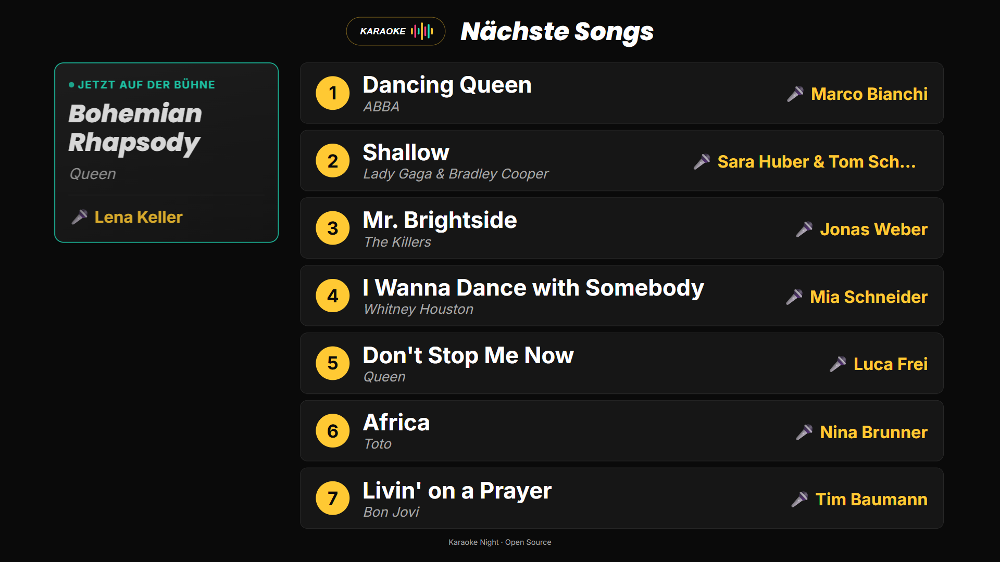
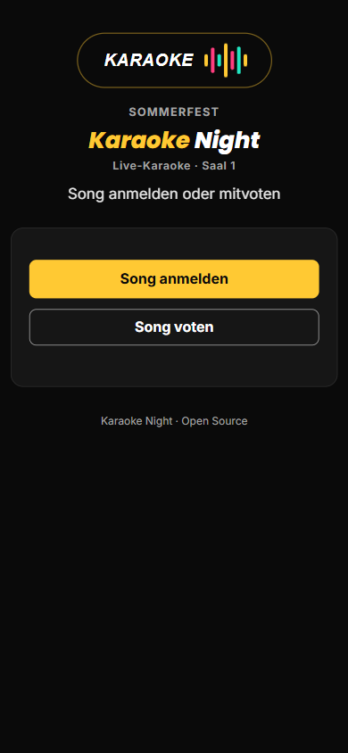
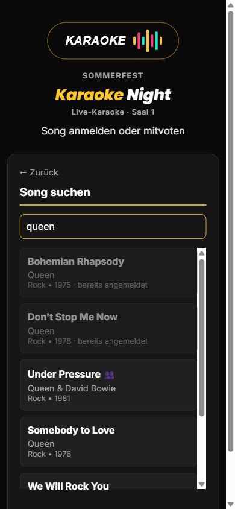
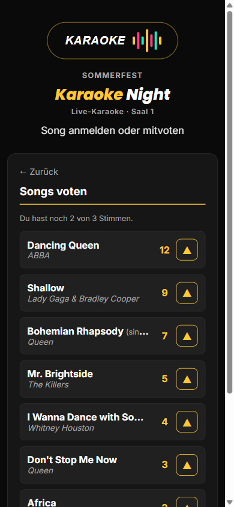
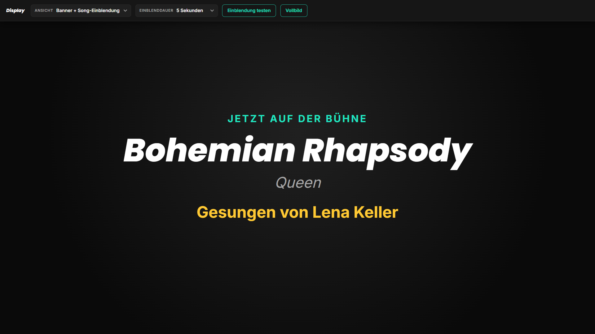
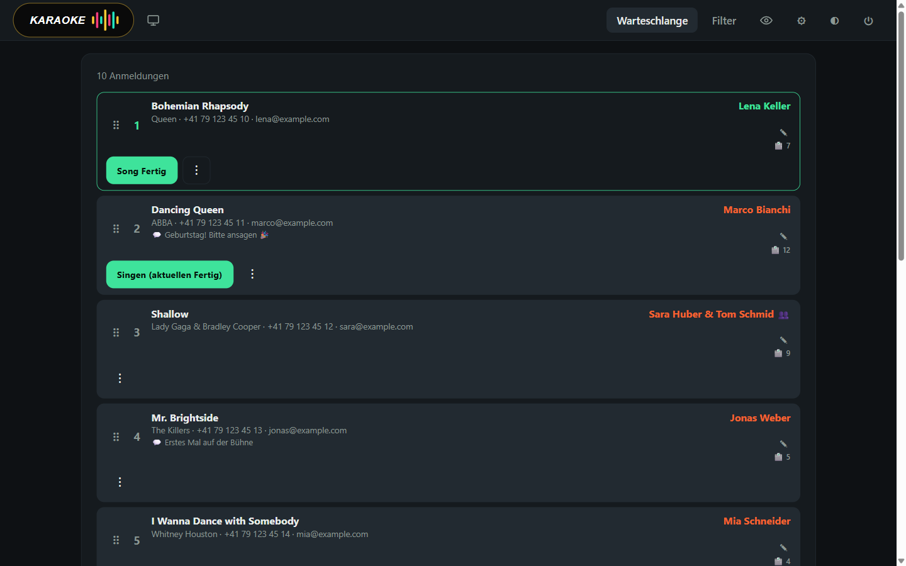
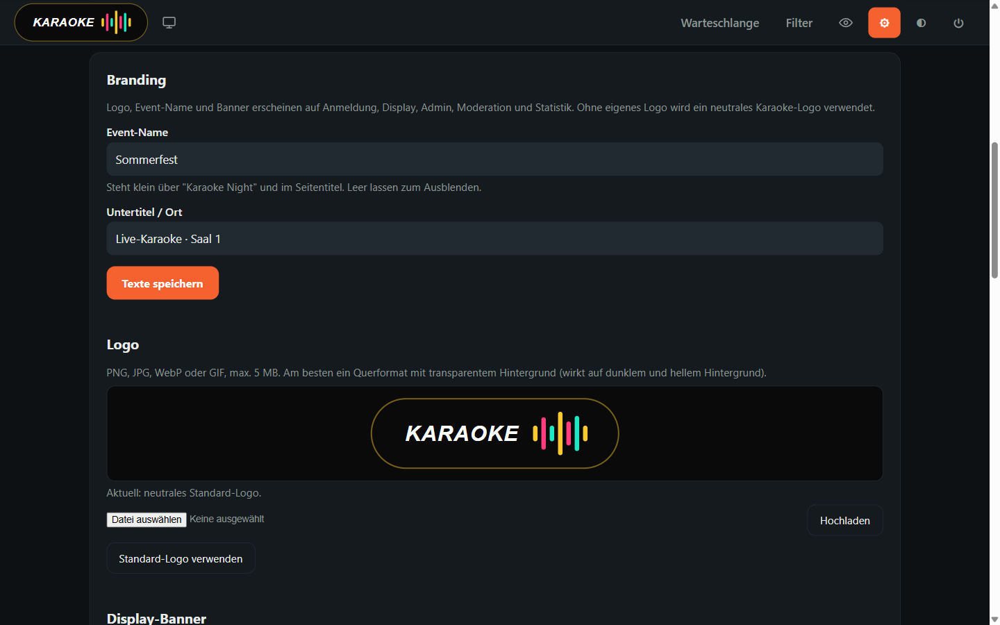
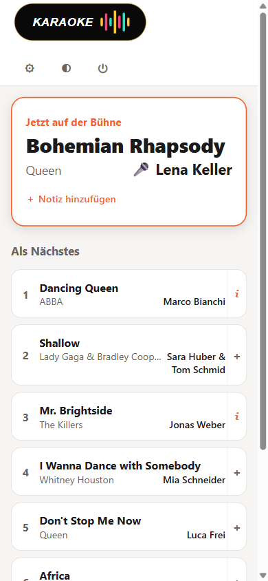

<div align="center">


# Karaoke Night

**Song-Anmeldung, Warteschlange und Bühnen-Display für Karaoke-Events –
per Handy, ohne App-Installation, auf jedem PHP-Webhosting.**


<sub>🇬🇧 A self-hosted karaoke sign-up system: guests pick songs on their phones, the crew manages the queue, a big screen shows who's up next. UI language: German.</sub>

<br>



</div>

---

## Was die App kann

Gäste scannen einen QR-Code, suchen ihren Song im Katalog und melden sich an – fertig.
Das Team gibt Anmeldungen frei, sortiert die Reihenfolge per Drag & Drop und startet
den nächsten Song mit einem Klick. Auf dem Beamer läuft die Warteschlange mit, beim
Sängerwechsel blendet das Display den neuen Song gross ein.

| | |
|---|---|
| 📱 **Anmeldung per Handy** | Songsuche im kompletten KaraFun-Katalog, Duette mit Partner-Angabe, bereits vergebene Songs werden markiert |
| 🗳️ **Voting** | Gäste geben anonym bis zu 3 Stimmen für ihre Lieblings-Songs ab – ohne Login |
| 🖥️ **Bühnen-Display** | Warteschlange im 16:9-Format, „Jetzt auf der Bühne"-Panel, Vollbild-Einblendung beim Sängerwechsel, Banner-Modus |
| 🎛️ **Admin-Panel** | Freigeben, Drag & Drop, Notizen, Anmelde-/Voting-Sperre, Ansage-Text, CSV-Export, Hell/Dunkel |
| 🎤 **Moderation** | Eigene Ansicht für die Ansage: wer singt, wer kommt als Nächstes, Notizen – mit Ton/Vibration bei neuen Anmeldungen |
| 🎨 **Eigenes Branding** | Logo, Display-Banner, Event-Name und Untertitel im Admin hochladen bzw. setzen – kein Code anfassen |
| 🚫 **Content-Filter** | Songs oder ganze Bands sperren bzw. „zur Prüfung" markieren, explizite Songs aus dem Katalog automatisch vormerken |
| 📊 **Statistik** | Getrennt geschützte Auswertung: Anmeldungen, Votes, Suchbegriffe, Wartezeiten, Setlist – ohne IP-Adressen |
| 🎚️ **Show-Steuerung** | API-Key-geschützte Control-API, z.B. für ein Stream Deck via [Bitfocus Companion](https://bitfocus.io/companion) |

## Screenshots

<table>
  <tr>
    <td width="33%" align="center"><br><sub><b>Gäste-Startseite</b></sub></td>
    <td width="33%" align="center"><br><sub><b>Songsuche</b></sub></td>
    <td width="33%" align="center"><br><sub><b>Voting</b></sub></td>
  </tr>
</table>

<table>
  <tr>
    <td width="50%" align="center"><br><sub><b>Einblendung beim Sängerwechsel</b> (mit Display-Toolbar)</sub></td>
    <td width="50%" align="center"><br><sub><b>Banner-Ansicht</b> – automatisch aus Logo und Event-Texten</sub></td>
  </tr>
  <tr>
    <td width="50%" align="center"><br><sub><b>Admin: Warteschlange</b></sub></td>
    <td width="50%" align="center"><br><sub><b>Admin: Branding</b></sub></td>
  </tr>
</table>

<p align="center"><br><sub><b>Moderation</b> (Handy)</sub></p>

## Die Seiten

| Seite | URL | Zugang | Für wen |
|---|---|---|---|
| Anmeldung & Voting | `/` | öffentlich | Gäste (Handy) |
| Display | `/display` | öffentlich | Beamer / TV im Saal |
| Admin | `/admin` | Admin-Passwort | Team / Technik |
| Moderation | `/moderation` | eigenes Passwort | Ansager:in |
| Statistik | `/stats` | eigenes Passwort, getrennt vom Admin | Auswertung |

## Voraussetzungen

- **PHP 8** (im Einsatz mit PHP 8.3) mit `pdo_mysql`, `fileinfo` und `mbstring`
- **MariaDB 10.x** (im Einsatz mit 10.6) – `database.sql` nutzt
  MariaDB-Syntax wie `ADD COLUMN IF NOT EXISTS`, die MySQL so nicht kennt
- **Apache** mit `.htaccess`-Unterstützung (`mod_rewrite`; `mod_headers` empfohlen)
- Optional **Node.js** – nur für den Katalog-Import per Kommandozeile, der Import
  geht auch direkt im Admin-Panel

Kein Composer, kein Build-Schritt, kein dauerhaft laufender Server-Prozess – ein
gewöhnliches Shared-Hosting genügt.

## Installation

### 1. Datenbank anlegen

Eine leere Datenbank (Zeichensatz `utf8mb4`) erstellen und das Schema einspielen:

```bash
mysql -u <user> -p <datenbank> < database.sql
```

`database.sql` ist idempotent und enthält auch alle Migrationen – nach einem
Update einfach erneut ausführen.

### 2. Konfiguration

`.env.example` nach `.env` kopieren und ausfüllen:

```ini
DB_HOST=localhost
DB_USER=karaoke
DB_PASSWORD=geheim
DB_NAME=karaoke
ADMIN_PASSWORD=startpasswort     # nach dem ersten Login im Admin ändern
STATS_PASSWORD=                  # optional, für /stats
```

### 3. Hochladen – flach!

Der Inhalt von `public/` gehört **direkt in den Webroot**, alles andere daneben.
Der Ordner `public` selbst wird nicht mit hochgeladen:

```text
Repository                      Webserver (Webroot)
──────────────────────────      ──────────────────────────
public/index.html          →    index.html
public/api/, css/, js/ …   →    api/, css/, js/ …
public/uploads/.htaccess   →    uploads/.htaccess
lib/, scripts/             →    lib/, scripts/
.htaccess, .env            →    .htaccess, .env
config.php, database.sql   →    config.php, database.sql
package.json               →    package.json
```

`README.md`, `LICENSE` und `docs/` werden auf dem Server nicht gebraucht.
Sensible Dateien (`.env`, `config.php`, `lib/`, `scripts/` …) sperrt die
mitgelieferte `.htaccess`.

> [!IMPORTANT]
> Der Ordner `uploads/` muss für PHP **beschreibbar** sein – dort landen Logo und
> Banner aus dem Admin-Panel.

### 4. Einrichten im Admin

1. `https://deine-domain/admin` öffnen und mit `ADMIN_PASSWORD` anmelden
2. **Einstellungen → Admin-Passwort ändern**
3. **Einstellungen → Branding**: Event-Name, Untertitel, Logo und optional ein Display-Banner setzen
4. **Einstellungen → Songkatalog verwalten**: KaraFun-CSV importieren oder Songs einzeln erfassen
5. Optional: Moderations-Passwort setzen, API-Key fürs Companion-Modul erzeugen

Fertig – den QR-Code auf `https://deine-domain/` drucken und los gehts. 🎤

## Branding

Die App kommt ohne fremdes Logo. Unter **Admin → Einstellungen → Branding** lässt
sich alles anpassen:

| Einstellung | Wirkung | Ohne Angabe |
|---|---|---|
| **Event-Name** | steht über „Karaoke Night", im Seitentitel und in den Login-Masken | ausgeblendet |
| **Untertitel / Ort** | Zeile unter „Karaoke Night" | ausgeblendet |
| **Logo** (PNG, JPG, WebP, GIF – max. 5 MB) | auf allen Seiten | neutrales Karaoke-Logo |
| **Display-Banner** (ideal 1920×1080, max. 10 MB) | Banner-Modus und „Banner + Song-Einblendung" | Banner aus Logo und Texten |

Änderungen wirken sofort, das Display übernimmt ein neues Logo ohne Neuladen.
SVG-Uploads sind bewusst nicht erlaubt, weil SVG-Dateien Skripte enthalten können.

## Songkatalog

Die App ist auf den Katalog von [KaraFun](https://www.karafun.com/) ausgelegt
(Semikolon-CSV mit `Id;Title;Artist;Year;Duo;Explicit;…`). Import entweder im
Admin-Panel per Datei-Upload oder per Kommandozeile:

```bash
npm install
npm run import karafuncatalog.csv
```

Songs, die laut Katalog explizit sind, werden beim Import automatisch zur
Prüfung markiert. Einzelne Songs lassen sich auch von Hand erfassen.

## Ablauf am Event

```text
Gast meldet an ──► Angemeldet ──► Genehmigt ──► Singt ──► Fertig
                   (nur Admin)    (Display,      (Display-
                                   Moderation)    Spotlight)
```

Neue Anmeldungen sieht zuerst nur das Admin-Team. Erst **„Genehmigt"** bringt
den Song aufs Display und in die Moderation. Ein Song kann nur einmal angemeldet
werden, bis er storniert wird.

**Display-Tipp:** Maus an den oberen Bildschirmrand bewegen – dort erscheint eine
Toolbar für Ansicht, Einblenddauer, Test-Einblendung und Vollbild. Für
Kiosk- oder OBS-Browser lässt sich die Ansicht per URL setzen:
`/display?ansicht=banner&dauer=10`.

## Show-Steuerung mit Companion

Für Stream Deck & Co. gibt es eine eigene Control-API (`api/control-*.php`),
geschützt mit einem API-Key aus **Einstellungen → Companion-Modul** (Header
`X-API-Key`): nächster Song, Song beenden, Banner-Modus, Anmelde-/Voting-Sperre,
Ansage-Text und ein Sammel-Status für Feedbacks.

## Sicherheit & Datenschutz

- Passwörter als bcrypt-Hash, zeitkonstante Vergleiche, Schutz vor Brute-Force beim Login
- Admin, Moderation, Statistik und Control-API haben getrennte Zugänge
- Uploads werden am Inhalt geprüft, bekommen zufällige Dateinamen und werden nie ausgeführt
- Die Statistik speichert keine IP-Adressen, Namen oder Kontaktdaten
- Telefonnummern und E-Mails der Anmeldungen sieht nur der Admin (CSV-Export für die eigene Ablage)

## Dokumentation

Architektur, Datenbank, vollständige API-Referenz, Design-System und Wartung:
**[docs/TECHNICAL.md](docs/TECHNICAL.md)**

## Lizenz

[MIT](LICENSE) © Fabian Meyer ([meyer.productions](https://meyer.productions))
